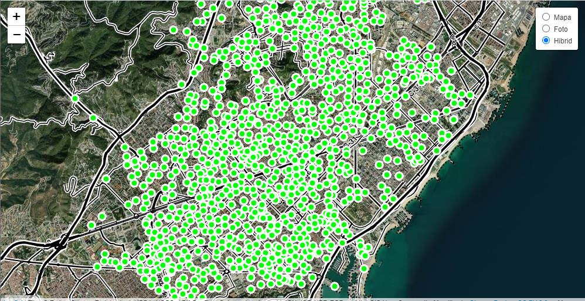
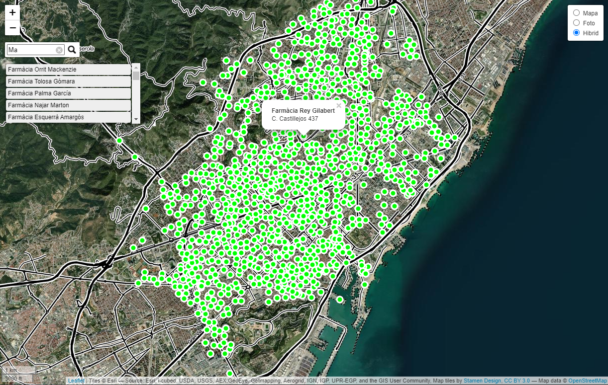
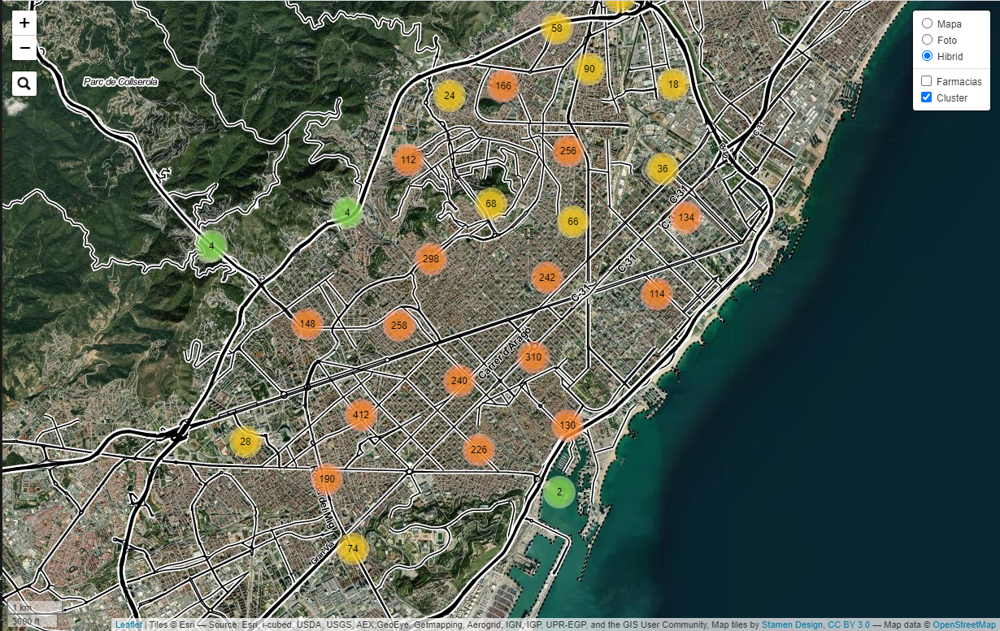

 


!!! warning "Atencion!!"
    <h3>
    *Buscador de Farmacias de Barcelona*

    Nos han encargado realizar un mapa para poder localizar y buscar las farmacias de Barcelona

    * Los datos de farmacias son del web de Datos Abiertos de Barcelona

    [https://opendata-ajuntament.barcelona.cat/data/es/dataset/sanitat-farmacies](https://opendata-ajuntament.barcelona.cat/data/es/dataset/sanitat-farmacies){target=_blank} 

    * Existe un plugin de Leaflet llamado **Leaflet-ajax** que permite cargar capas GeoJSON ya sea en local o en remoto

        * Leaflet-ajax [https://github.com/calvinmetcalf/leaflet-ajax](https://github.com/calvinmetcalf/leaflet-ajax){target=_blank}  


    * Existe un plugin de Leaflet llamado **Leaflet-search** que permite buscar dentro de atributos de un GeoJSON

        * Leaflet-Search [https://github.com/stefanocudini/leaflet-search](https://github.com/stefanocudini/leaflet-search){target=_blank}  

    </h3>

### Ejemplo buscador de Farmacias

#### Paso 1:Visualizar datos 
      
 *  Visualizamos con QGIS para ver cómo es, el archivo de **/geoweb/datos/farmacias.geojson**

!!! tip "Convertir a GeoJson"

    El archivo de farmacias lo hemos descargado del portal [https://opendata-ajuntament.barcelona.cat/data/es/dataset/sanitat-farmacies](https://opendata-ajuntament.barcelona.cat/data/es/dataset/sanitat-farmacies){target=_blank} en formato CSV y lo hemos transformado a GeoJSON

    Para ver cómo transformar y reproyectar un archivo CSV a GeoJson con Qgis mira el **video 7**
 
#### Paso 2: Crear archivo farmacias.html

 * Abrimos archivo **mapabase.html** y guardamos como *File-->Save as* **farmacias.html**
 * Añadimos un titulo y la función  inicial **initMapaFarmacias()** de nuestro proyecto
* Llamamos a la función **initMapaFarmacias()** en el body onLoad
 ``` html hl_lines="3 14 15 16 17 18 22"

    <html lang="es">
    <head>
        <title>Farmacias</title>
        <meta charset="utf-8" />
        <meta name="viewport" content="width=device-width, initial-scale=1.0" />
        <meta name="author" content="autor" />
        <meta name="description" content="descripción página" />
        <meta name="robots" content="index,follow" />
        <link rel="stylesheet" href="https://unpkg.com/leaflet@1.7.1/dist/leaflet.css" />
        <script src="https://unpkg.com/leaflet@1.7.1/dist/leaflet.js"></script>

        <link rel="stylesheet" href="css/estilobase.css" />
        <script src="js/mapabase.js"></script>
        <script>       
            function initMapaFarmacias(){
                init();              
            }         
        </script>

    </head>

    <body onLoad="initMapaFarmacias()">
        <div id="map"> </div>
    </body>

    </html>

 ```
#### Paso 3:Añadir plugin

 * Añadimos Plugins al proyecto

   >Podemos descargar plugins del directorio **/dist** y guardarlos en nuestros directorios **/js** o **/css**

   >También podemos utilizar la URL directamente (**nuestro caso**)

``` html hl_lines="12"

<html lang="es">
    <head>
        <title>Farmacias</title>
        <meta charset="utf-8" />
        <meta name="viewport" content="width=device-width, initial-scale=1.0" />
        <meta name="author" content="autor" />
        <meta name="description" content="descripción página" />
        <meta name="robots" content="index,follow" />
        <link rel="stylesheet" href="https://unpkg.com/leaflet@1.7.1/dist/leaflet.css" />
        <script src="https://unpkg.com/leaflet@1.7.1/dist/leaflet.js"></script>

        <script src="https://calvinmetcalf.github.io/leaflet-ajax/dist/leaflet.ajax.js"></script>

        <link rel="stylesheet" href="css/estilobase.css" />
        <script src="js/mapabase.js"></script>
        <script>       
            function initMapaFarmacias(){
                init();              
            }         
        </script>

    </head>

    <body onLoad="initMapaFarmacias()">
        <div id="map"> </div>
    </body>

    </html>

``` 


#### Paso 4:Cargamos GeoJson Farmacias

 * Miramos documentación Leaflet-Ajax plugin https://github.com/calvinmetcalf/leaflet-ajax
 * Miramos referencia L.Geojson https://leafletjs.com/reference-1.7.1.html#geojson
 * Dentro de nuestro directorio **/geoweb/js/** creamos el archivo **farmacias.js**    

``` javascript
var layerFarmacias;
var urlFarmacias = "datos/farmacias.geojson";

function addDatosFarmacias() {

        layerFarmacias  = new L.GeoJSON.AJAX(urlFarmacias, {
            onEachFeature: function (feature, layer) {
                popupContent = "<b>" + feature.properties.EQUIPAMENT + "</b>"+
                "<br>" + feature.properties.TIPUS_VIA +
                ". " + feature.properties.NOM_CARRER +
                " " + feature.properties.NUM_CARRER_1 + "</b>";
                layer.bindPopup(popupContent);
            },
            pointToLayer: function (feature, latlng) {
                return L.circleMarker(latlng, {
                    radius: 6,
                    fillColor: "#00ff00",
                    color: "#ffffff",
                    weight: 3,
                    opacity: 1,
                    fillOpacity: 0.8
                });
            }
        }).addTo(map);

        map.setView([41.399733,2.168598],13);
        // controlCapas.addOverlay(layerFarmacias,"Farmacias");

}//fin funcion

```


#### Paso 5:

* Añadimos **farmacias.js** al archivo **farmacias.html**
* Llamamos funcion **addDatosFarmacias()**

``` html hl_lines="16 20"
<html lang="es">
    <head>
        <title>Farmacias</title>
        <meta charset="utf-8" />
        <meta name="viewport" content="width=device-width, initial-scale=1.0" />
        <meta name="author" content="autor" />
        <meta name="description" content="descripción página" />
        <meta name="robots" content="index,follow" />
        <link rel="stylesheet" href="https://unpkg.com/leaflet@1.7.1/dist/leaflet.css" />
        <script src="https://unpkg.com/leaflet@1.7.1/dist/leaflet.js"></script>

        <script src="https://calvinmetcalf.github.io/leaflet-ajax/dist/leaflet.ajax.js"></script>

        <link rel="stylesheet" href="css/estilobase.css" />
        <script src="js/mapabase.js"></script>
        <script src="js/farmacias.js"></script>
        <script>       
            function initMapaFarmacias(){
                init();  
                addDatosFarmacias();            
            }         
        </script>

    </head>

    <body onLoad="initMapaFarmacias()">
        <div id="map"> </div>
    </body>

    </html>
```

* Visualizamos mapa



#### Paso 6:Añadir opción para buscar Farmacias

 * Miramos documentación Leaflet-Search plugin https://github.com/stefanocudini/leaflet-search
 * Añadimos URL plugin

```html hl_lines="14 15"
<html lang="es">
    <head>
        <title>Farmacias</title>
        <meta charset="utf-8" />
        <meta name="viewport" content="width=device-width, initial-scale=1.0" />
        <meta name="author" content="autor" />
        <meta name="description" content="descripción página" />
        <meta name="robots" content="index,follow" />
        <link rel="stylesheet" href="https://unpkg.com/leaflet@1.7.1/dist/leaflet.css" />
        <script src="https://unpkg.com/leaflet@1.7.1/dist/leaflet.js"></script>
     
        <script src="https://calvinmetcalf.github.io/leaflet-ajax/dist/leaflet.ajax.js"></script>

        <script src="https://labs.easyblog.it/maps/leaflet-search/src/leaflet-search.js"></script>
        <link rel="stylesheet" href="https://labs.easyblog.it/maps/leaflet-search/src/leaflet-search.css" />

        <link rel="stylesheet" href="css/estilobase.css" />
        <script src="js/mapabase.js"></script>
        <script src="js/farmacias.js"></script>
        <script>       
            function initMapaFarmacias(){
                init();  
                addDatosFarmacias();            
            }         
        </script>

    </head>

    <body onLoad="initMapaFarmacias()">
        <div id="map"> </div>
    </body>

    </html>
```

 * Añadimos el control dentro de la función **addDatosFarmacias()** de  **farmacias.js** 


``` javascript hl_lines="29 30 31 32 33 34 35 36 37 38 39 40 41 42"
var layerFarmacias;
var urlFarmacias = "datos/farmacias.geojson";

function addDatosFarmacias() {

        layerFarmacias  = new L.GeoJSON.AJAX(urlFarmacias, {
            onEachFeature: function (feature, layer) {
                popupContent = "<b>" + feature.properties.EQUIPAMENT + "</b>"+
                "<br>" + feature.properties.TIPUS_VIA +
                ". " + feature.properties.NOM_CARRER +
                " " + feature.properties.NUM_CARRER_1 + "</b>";
                layer.bindPopup(popupContent);
            },
            pointToLayer: function (feature, latlng) {
                return L.circleMarker(latlng, {
                    radius: 6,
                    fillColor: "#00ff00",
                    color: "#ffffff",
                    weight: 3,
                    opacity: 1,
                    fillOpacity: 0.8
                });
            }
        }).addTo(map);

        map.setView([41.399733,2.168598],13);
        // controlCapas.addOverlay(layerFarmacias,"Farmacias");

        var searchControl = new L.Control.Search({
            layer: layerFarmacias,
            initial:false,
            propertyName: 'EQUIPAMENT',
            circleLocation: true,
            moveToLocation: function (latlng) {
                map.setView(latlng, 17);
            }
        });

        searchControl.on('search:locationfound', function(e) {
            e.layer.openPopup();
        });
        map.addControl(searchControl);

} //fin funcion

```

 * Probamos visor y buscamos farmácias

 

#### Paso 7: ¿Añadimos el plugin de Cluster?

Este es uno de lo plugins más utilizados en Lealfte

* Miramos documentación [https://github.com/Leaflet/Leaflet.markercluster](https://github.com/Leaflet/Leaflet.markercluster){target=_blank}


 * Añadimos URL plugin

```html hl_lines="17 18 19"
<html lang="es">
    <head>
        <title>Farmacias</title>
        <meta charset="utf-8" />
        <meta name="viewport" content="width=device-width, initial-scale=1.0" />
        <meta name="author" content="autor" />
        <meta name="description" content="descripción página" />
        <meta name="robots" content="index,follow" />
        <link rel="stylesheet" href="https://unpkg.com/leaflet@1.7.1/dist/leaflet.css" />
        <script src="https://unpkg.com/leaflet@1.7.1/dist/leaflet.js"></script>
     
        <script src="https://calvinmetcalf.github.io/leaflet-ajax/dist/leaflet.ajax.js"></script>

        <script src="https://labs.easyblog.it/maps/leaflet-search/src/leaflet-search.js"></script>
        <link rel="stylesheet" href="https://labs.easyblog.it/maps/leaflet-search/src/leaflet-search.css" />

        <link rel="stylesheet" href="https://unpkg.com/leaflet.markercluster@1.4.1/dist/MarkerCluster.css" />
        <link rel="stylesheet" href="https://unpkg.com/leaflet.markercluster@1.4.1/dist/MarkerCluster.Default.css" />
        <script src="https://unpkg.com/leaflet.markercluster@1.4.1/dist/leaflet.markercluster.js"></script>


        <link rel="stylesheet" href="css/estilobase.css" />
        <script src="js/mapabase.js"></script>
        <script src="js/farmacias.js"></script>
        <script>       
            function initMapaFarmacias(){
                init();  
                addDatosFarmacias();            
            }         
        </script>

    </head>

    <body onLoad="initMapaFarmacias()">
        <div id="map"> </div>
    </body>

    </html>
```

* Añadimos la capa dentro de la función **addDatosFarmacias()** de  **farmacias.js** 


``` javascript hl_lines="6 17 30 32"
var layerFarmacias;
var urlFarmacias = "datos/farmacias.geojson";

function addDatosFarmacias() {

        var puntosCluster = L.markerClusterGroup();

        layerFarmacias  = new L.GeoJSON.AJAX(urlFarmacias, {
            onEachFeature: function (feature, layer) {
                popupContent = "<b>" + feature.properties.EQUIPAMENT + "</b>"+
                "<br>" + feature.properties.TIPUS_VIA +
                ". " + feature.properties.NOM_CARRER +
                " " + feature.properties.NUM_CARRER_1 + "</b>";
                layer.bindPopup(popupContent);
            },
            pointToLayer: function (feature, latlng) {
                puntosCluster.addLayer(L.marker(latlng));
                return L.circleMarker(latlng, {
                    radius: 6,
                    fillColor: "#00ff00",
                    color: "#ffffff",
                    weight: 3,
                    opacity: 1,
                    fillOpacity: 0.8
                });
            }
        }).addTo(map);

        map.setView([41.399733,2.168598],13);
        controlCapas.addOverlay(layerFarmacias,"Farmacias");

        controlCapas.addOverlay(puntosCluster,"Cluster");

        var searchControl = new L.Control.Search({
            layer: layerFarmacias,
            initial:false,
            propertyName: 'EQUIPAMENT',
            circleLocation: true,
            moveToLocation: function (latlng) {
                map.setView(latlng, 17);
            }
        });

        searchControl.on('search:locationfound', function(e) {
            e.layer.openPopup();
        });
        map.addControl(searchControl);
       

} //fin funcion

```

* Probamos visualización


!!! success "¿Subimos el ejemplo al GitHub?"
    Acordaros tambiés de actualizar index.html
	
	```bash

		git pull
        git add .
        git commit -m "ejemplos leaflet"
        git push origin main

	```    

!!! tip "Soluciones sesion 2"
    Visualizar [https://gis-master-m2.github.io/geoweb/](https://gis-master-m2.github.io/geoweb/){target=_blank}

    Descargar [https://github.com/gis-master-m2/geoweb/archive/main.zip](https://github.com/gis-master-m2/geoweb/archive/main.zip){target=_blank}


### Anexos 

#### Ejemplos de GeoJSONs con plugin GeoJSON AJAX

> diferentes formas de trabajar con GeoJSONs y el plugin de GeoJSON.AJAX

!!! example "GeoJson por defecto"

    ```javascript

      var comarcasPoligonoDefault = new L.GeoJSON.AJAX('datos/comarcas.geojson').addTo(map);

      var farmaciasPuntoDefault = new L.GeoJSON.AJAX('datos/farmacias.geojson').addTo(map);

      var carrilsBiciLineaDefault = new L.GeoJSON.AJAX('datos/carrils-bici.geojson').addTo(map);

    
            
    ```

!!! example "GeoJson con estilos"

    ```javascript

    var comarcasPoligonoStyle = new L.GeoJSON.AJAX('datos/comarcas.geojson', {
                    style: function (feature) {
                        return {

                            fillColor: "#fab81e",
                            color: "#ffffff",
                            weight: 2,
                            opacity: 1,
                            fillOpacity: 0.5
                        }
                    }
                }).addTo(map);
      var farmaciasPuntoStyle = new L.GeoJSON.AJAX('datos/farmacias.geojson', {

                pointToLayer: function (feature, latlng) {
                    return L.circleMarker(latlng, {
                        radius: 6,
                        fillColor: "#00ff00",
                        color: "#ffffff",
                        weight: 3,
                        opacity: 1,
                        fillOpacity: 0.8
                    })
                }
            }).addTo(map);

            var carrilsBiciLineaStyle = new L.GeoJSON.AJAX('datos/carrils-bici.geojson', {
                style: function (feature) {
                    return {
                        color: "#d607f2",
                        weight: 6
                    }
                }
            }).addTo(map);

    ```   

!!! example "GeoJson con estilos y Popups"

    ```javascript

    var comarcasPoligonoStylePop = new L.GeoJSON.AJAX('datos/comarcas.geojson', {
                style: function (feature) {
                    return {

                        fillColor: "#fab81e",
                        color: "#ffffff",
                        weight: 2,
                        opacity: 1,
                        fillOpacity: 0.5
                    }
                },
                    onEachFeature: function (feature, layer) {
                        popupContentPol = "<b>" + feature.properties.NOM + "</b>";
                        layer.bindPopup(popupContentPol);
                    },
                
            }).addTo(map);


            var farmaciasPuntoStylePop = new L.GeoJSON.AJAX('datos/farmacias.geojson', {

                pointToLayer: function (feature, latlng) {
                    return L.circleMarker(latlng, {
                        radius: 6,
                        fillColor: "#00ff00",
                        color: "#ffffff",
                        weight: 3,
                        opacity: 1,
                        fillOpacity: 0.8
                    })
                },
                onEachFeature: function (feature, layer) {
                    popupContentP = "<b>" + feature.properties.EQUIPAMENT + "</b>";
                    layer.bindPopup(popupContentP);
                },
            }).addTo(map);

            var carrilsBiciLineaStylePop = new L.GeoJSON.AJAX('datos/carrils-bici.geojson', {
                style: function (feature) {
                    return {
                        color: "#d607f2",
                        weight: 6
                    }
                },
                onEachFeature: function (feature, layer) {
                    popupContentL = "<b>" + feature.properties.TOOLTIP + "</b>";
                    layer.bindPopup(popupContentL);
                },
            }).addTo(map);
            
    ```   
 
!!! example "GeoJson remoto"

    ```javascript

      var rivers = new L.GeoJSON.AJAX(
        'https://raw.githubusercontent.com/nvkelso/natural-earth-vector/master/geojson/ne_10m_rivers_europe.geojson', {
            
            style: function (feature) {
                return {
                    color: "#00ffe1",
                    weight: 6
                }
            },
        }).addTo(map);

             
    ```

 


 
