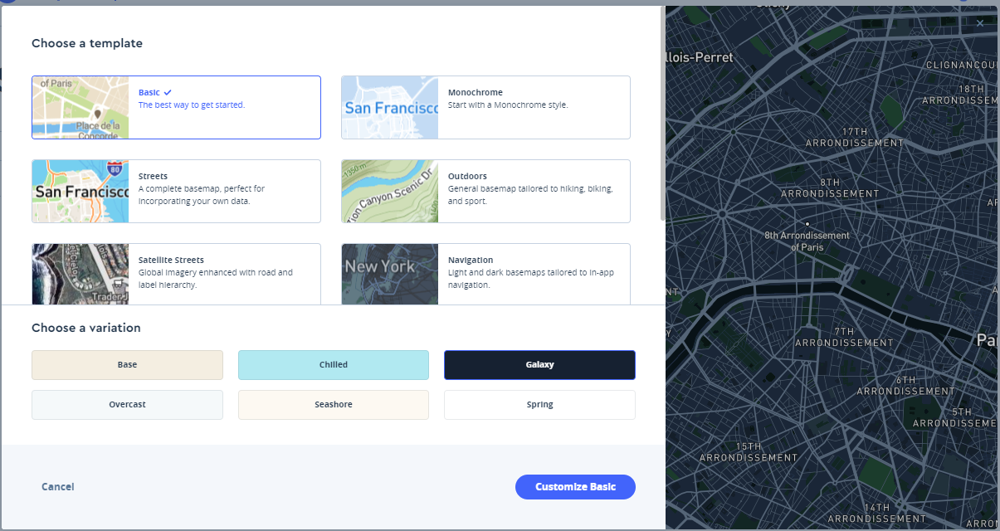
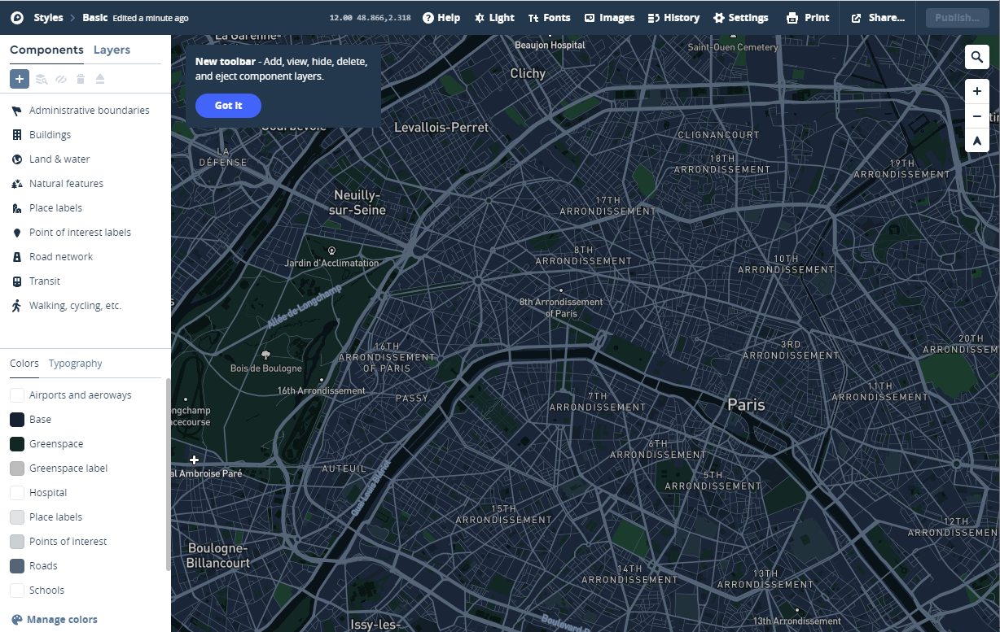
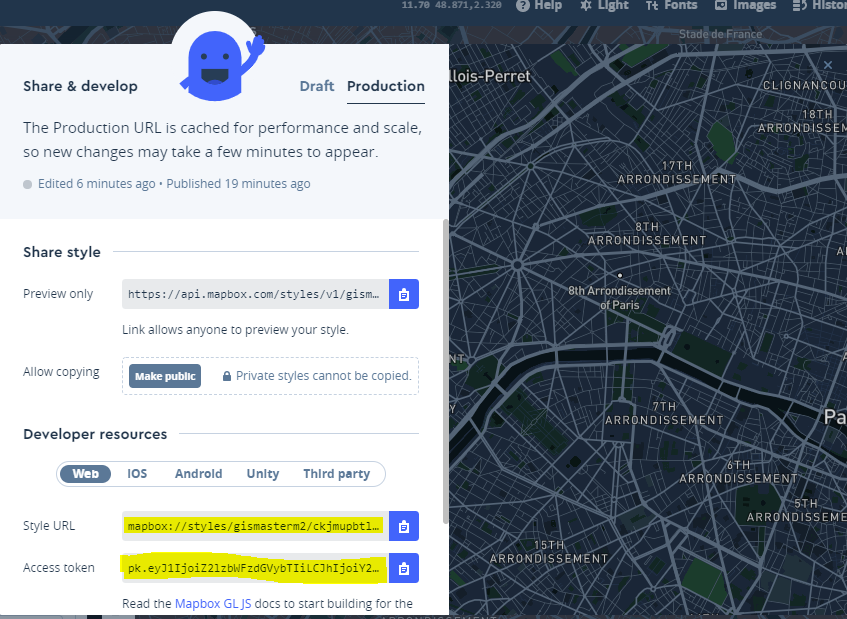
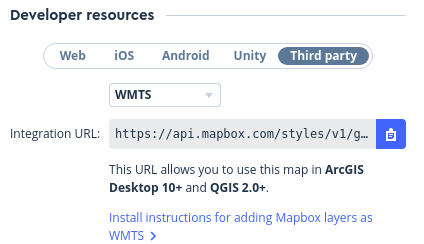
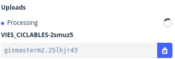

 
       
#### Web
* [https://www.mapbox.com/](https://www.mapbox.com/)

#### Productos
* [https://www.mapbox.com/products/](https://www.mapbox.com/products/)

#### APIs
* [https://www.mapbox.com/api-documentation/](https://www.mapbox.com/api-documentation/)

#### **Página referéncia MapBox GL!!**
* [https://www.mapbox.com/mapbox-gl-js/api/](https://www.mapbox.com/mapbox-gl-js/api/)

#### GitHUB
* [https://github.com/mapbox](https://github.com/mapbox)

#### Tutoriales
* [https://www.mapbox.com/mapbox-gl-js/example/simple-map/](https://www.mapbox.com/mapbox-gl-js/example/simple-map/)
* [https://www.mapbox.com/help/tutorials/](https://www.mapbox.com/help/tutorials/)
* [https://www.mapbox.com/help/studio-manual/](https://www.mapbox.com/help/studio-manual/)
* [https://ovrdc.github.io/gis-tutorials/mapbox/](https://ovrdc.github.io/gis-tutorials/mapbox/)

#### Videos
* [https://www.youtube.com/watch?v=jrnoFU5Wkdo](https://www.youtube.com/watch?v=jrnoFU5Wkdo)
* [https://www.youtube.com/watch?v=Zn3Xx-TSrM8](https://www.youtube.com/watch?v=Zn3Xx-TSrM8)
* [https://www.youtube.com/watch?v=r6Ij_34xTD0](https://www.youtube.com/watch?v=r6Ij_34xTD0)
* [https://www.youtube.com/watch?v=YhynsA9_fPc](https://www.youtube.com/watch?v=YhynsA9_fPc)


### Descripción 

[Ver presentación](presentacion/vector-tiles.pptx)

> MapxBox es una empresa privada que ofrece una plataforma para la publicacón de mapas. Mapbox destaca por creado de forma abierta
> MBTiles
> Vector Tiles
> MapBox GL

* MapBox Studio es una herramienta para personalizar y publicar estilos de mapa vector
* Maputnik es un editor libre (no de Mapbox) que también sirve para editar estilos de mapas vector


     
###  ¿Cómo empezar?

> Nos damos de alta en [MapBox](https://www.mapbox.com/signup/)

### MapBox Studio

### 1-Creamos nuestor propio estilo

* Entramos en MapBox.com  seleccionamos nuestro avatar `Studio` 

* Dentro de Studio tenemos tres opciones básicas

    * **Styles**: Para crear nuestros estilos pròpios
    * **Tilesets**: Para subir nuestros datos y convertirlos en Vector Tiles y/o integrarlos con nuestros estilos
    * **Dataset**: Para subir capas GeoJson que pueden ser convertidas a Tilesets

* Seleccionamos -->`Styles` --> `New style`



* Seleccionamos un estilo como base y cambiamos colores `Customize`



* Cambiamos nombre del estilo "Bicing"


* Una vez hemos acabado -->`Publish your style` --> `Publish as new`

* Share, develop, and use your style -- Copiamos `Style URL` y `Access token`  



!!! tip "Truco"
    <h5>
    Si seleccionamos "Third party" tambié podemos exponer el estilo com WMTS (Raster) en Leaflet!!
    </h5>
    


!!! tip "Nos divertimos con Cartogram!!"
    [https://apps.mapbox.com/cartogram/](https://apps.mapbox.com/cartogram/)


### 2-Visualizar estilo propio con Mapbox Gl JS

MapBox tiene una libreria JavaScript llamada *MapBox GL JS* para visualizar estilos entre otras muchas otras funcionalidades

**Página referéncia MapBox GL!!**
* [https://www.mapbox.com/mapbox-gl-js/api/](https://www.mapbox.com/mapbox-gl-js/api/)

!!! warning
    <h4>
    Siempre que utilizemos algún estilo de Mapbox studio o algún servicio de Mapbox deberemos añadir nuestro Access Token
    </h4>


!!! tip "mapboxgl.Map"

        Es el constructor principal del mapa [https://docs.mapbox.com/mapbox-gl-js/api/#map](https://docs.mapbox.com/mapbox-gl-js/api/#map)

        ```javascript
            var map = new mapboxgl.Map({
                container: 'map', // container id
                style: 'mapbox://styles/mapbox/streets-v11', // stylesheet location
                center: [-74.5, 40], // starting position [lng, lat]
                zoom: 9 // starting zoom
                });
        ```

Creamos **mapbox-basico.html**

```html
<html>
<head>
    <meta charset='utf-8' />
    <title>Mapbox estilo</title>
    <meta name='viewport' content='initial-scale=1,maximum-scale=1,user-scalable=no' />
    <script src='https://api.tiles.mapbox.com/mapbox-gl-js/v1.6.1/mapbox-gl.js'></script>
    <link href='https://api.tiles.mapbox.com/mapbox-gl-js/v1.6.1/mapbox-gl.css' rel='stylesheet' />
    <style>
        body {
            margin: 0;
            padding: 0;
        }
        #map {
            position: absolute;
            top: 0;
            bottom: 0;
            width: 100%;
            height: 100%
        }
    </style>
    <script>
        //Añadir vuestor token y vuestro estilo
        function init() {
            mapboxgl.accessToken =
                'pk.eyJ1IjoiZ2lzbWFzdGVybTIiLCJhIjoiY2plZHhubTQxMTNoYzMza3Rqa3kxYTdrOCJ9.53B1E6mKD_EQOVb2Y0-SsA';
            var map = new mapboxgl.Map({
                container: 'map',
                style: 'mapbox://styles/gismasterm2/ck4zvjxxs2b8m1cmjumqlru5i',
                center: [2.16859, 41.3954],
                zoom: 13,
                attributionControl: false
            });

        }
    </script>
</head>

<body onload="init()">
    <div id="map"></div>
</body>

</html>  

```

Podemos añadir algunos controles

!!! example "Controles"
    
    [https://docs.mapbox.com/mapbox-gl-js/api/#user%20interface](https://docs.mapbox.com/mapbox-gl-js/api/#user%20interface)

    IControl

    NavigationControl

    GeolocateControl

    AttributionControl

    ScaleControl

    FullscreenControl

    Popup

    Marker

```html hl_lines="33 34"
 <html>
<head>
    <meta charset='utf-8' />
    <title>Mapbox estilo</title>
    <meta name='viewport' content='initial-scale=1,maximum-scale=1,user-scalable=no' />
    <script src='https://api.tiles.mapbox.com/mapbox-gl-js/v1.6.1/mapbox-gl.js'></script>
    <link href='https://api.tiles.mapbox.com/mapbox-gl-js/v1.6.1/mapbox-gl.css' rel='stylesheet' />
    <style>
        body {
            margin: 0;
            padding: 0;
        }
        #map {
            position: absolute;
            top: 0;
            bottom: 0;
            width: 100%;
            height: 100%
        }
    </style>
    <script>
        //Añadir vuestor token y vuestro estilo
        function init() {
            mapboxgl.accessToken =
                'pk.eyJ1IjoiZ2lzbWFzdGVybTIiLCJhIjoiY2plZHhubTQxMTNoYzMza3Rqa3kxYTdrOCJ9.53B1E6mKD_EQOVb2Y0-SsA';
            var map = new mapboxgl.Map({
                container: 'map',
                style: 'mapbox://styles/gismasterm2/ck4zvjxxs2b8m1cmjumqlru5i',
                center: [2.16859, 41.3954],
                zoom: 13,
                attributionControl: false
            });
            map.addControl(new mapboxgl.AttributionControl({compact: true}));
            map.addControl(new mapboxgl.NavigationControl());
        }
    </script>
</head>

<body onload="init()">
    <div id="map"></div>
</body>

</html>
```

!!! tip "¿Añadimos control GeoLocalización?"
    
    [https://docs.mapbox.com/mapbox-gl-js/api/#geolocatecontrol](https://docs.mapbox.com/mapbox-gl-js/api/#geolocatecontrol)

    ```javascript
    map.addControl(new mapboxgl.GeolocateControl());

    ```
    o con opciones...

    ```javascript

    map.addControl(new mapboxgl.GeolocateControl({
        positionOptions: {
            enableHighAccuracy: true
        },
        trackUserLocation: true
    }));

    ```


!!! tip "¿Añadimos un marker?"
    
    [https://docs.mapbox.com/mapbox-gl-js/api/#marker](https://docs.mapbox.com/mapbox-gl-js/api/#marker)
    
    ``` javascript
        var marker = new mapboxgl.Marker()
            .setLngLat([2.161648, 41.3977])
            .addTo(map);

    ```


### 3-Añadir una capa nueva propia a un estilo

Nos gustaria que en nuestro estilo estuvieran los carriles bici de Barcelona


[https://opendata-ajuntament.barcelona.cat/data/es/dataset/carril-bici](https://opendata-ajuntament.barcelona.cat/data/es/dataset/carril-bici)


#### Paso 1

* Descargamos en formato **GeoJson** los carriles bicicleta de barcelona en [https://opendata-ajuntament.barcelona.cat/data/es/dataset/carril-bici](https://opendata-ajuntament.barcelona.cat/data/es/dataset/carril-bici)
  

* Utilizamos QGIS para visualizar

     
#### Paso 2 -Añadimos la capa a Mapbox.com 

* Entramos en MapBox.com `Studio` --> `Tilesets` -->`New tileset` Arrastramos **CARRIL_BICI.geojson**

* Añadimos TileSet a nuestro estilo

* `Studio` --> `Styles` -->`Bicing` --> `Layers` --> `Add Layer` -->`Carril_Bici`


* Cambiamos color

* Publicamos

* Visualizamos mapbox-basico.html  ¿Que ha pasado?

 

### 4- Visualizar nuestor propio Tileset como una capa independiente


#### Paso 1

* Descargamos las vias ciclables de Barcelona (vias que no son carriles bici pero se puede ir en bicicleta ) [https://opendata-ajuntament.barcelona.cat/data/es/dataset/bicing](https://opendata-ajuntament.barcelona.cat/data/es/dataset/bicing)

* En formato GeoJson **VIES_CICLABLES.geojson**

#### Paso 2

* Entramos en MapBox.com `Studio` --> `Tilesets` -->`New tileset` Arrastramos **VIES_CICLABLES.geojson**

*Copiamos ID y nombre de la capa



Editamos **mapbox-basico.html** y añadimos

```html hl_lines="37 38 39 40 41 42 43 44 45 46 47 48 49 50 51 52 53"
<html>
<head>
    <meta charset='utf-8' />
    <title>Mapbox estilo</title>
    <meta name='viewport' content='initial-scale=1,maximum-scale=1,user-scalable=no' />
    <script src='https://api.tiles.mapbox.com/mapbox-gl-js/v1.6.1/mapbox-gl.js'></script>
    <link href='https://api.tiles.mapbox.com/mapbox-gl-js/v1.6.1/mapbox-gl.css' rel='stylesheet' />
    <style>
        body {
            margin: 0;
            padding: 0;
        }
        #map {
            position: absolute;
            top: 0;
            bottom: 0;
            width: 100%;
            height: 100%
        }
    </style>
    <script>
        //Añadir vuestor token y vuestro estilo
        function init() {
            mapboxgl.accessToken =
                'pk.eyJ1IjoiZ2lzbWFzdGVybTIiLCJhIjoiY2plZHhubTQxMTNoYzMza3Rqa3kxYTdrOCJ9.53B1E6mKD_EQOVb2Y0-SsA';
            var map = new mapboxgl.Map({
                container: 'map',
                style: 'mapbox://styles/gismasterm2/ck4zvjxxs2b8m1cmjumqlru5i',
                center: [2.16859, 41.3954],
                zoom: 13,
                attributionControl: false
            });
            map.addControl(new mapboxgl.AttributionControl({compact: true}));
            map.addControl(new mapboxgl.NavigationControl());


            map.on('load', function () {
                map.addSource("viasciclables_source", {
                    type: "vector",
                    url: "mapbox://gismasterm2.25lhjr43" //poner mapbox://vuestro id
                }); //fin map source

                map.addLayer({
                    id: "viasciclables",
                    type: "line",
                    source: "viasciclables_source",
                    'source-layer': "VIES_CICLABLES-2smuz5", //poner vuestro titulo capa
                    paint:{
                        'line-color':"#00ff00",
                        "line-width":3
                    }
                });
            });


        }
    </script>
</head>

<body onload="init()">
    <div id="map"></div>
</body>

</html>

``` 

!!! note "Probamos cambiar estilo de las vias ciclables"
   
    [https://docs.mapbox.com/mapbox-gl-js/style-spec/#layers-line](https://docs.mapbox.com/mapbox-gl-js/style-spec/#layers-line)


Añadimos un Popup al evento click

!!! tip "Eventos del mapa"
    
    [https://docs.mapbox.com/mapbox-gl-js/api/#map.event:click](https://docs.mapbox.com/mapbox-gl-js/api/#map.event:click)
    
  
```html hl_lines="56 57 58 59 60 61 62 63 64 65 66 67 68 69 70 71 72 73 74 75 76 77"
<html>
<head>
    <meta charset='utf-8' />
    <title>Mapbox estilo</title>
    <meta name='viewport' content='initial-scale=1,maximum-scale=1,user-scalable=no' />
    <script src='https://api.tiles.mapbox.com/mapbox-gl-js/v1.6.1/mapbox-gl.js'></script>
    <link href='https://api.tiles.mapbox.com/mapbox-gl-js/v1.6.1/mapbox-gl.css' rel='stylesheet' />
    <style>
        body {
            margin: 0;
            padding: 0;
        }
        #map {
            position: absolute;
            top: 0;
            bottom: 0;
            width: 100%;
            height: 100%
        }
    </style>
    <script>
        //Añadir vuestor token y vuestro estilo
        function init() {
            mapboxgl.accessToken =
                'pk.eyJ1IjoiZ2lzbWFzdGVybTIiLCJhIjoiY2plZHhubTQxMTNoYzMza3Rqa3kxYTdrOCJ9.53B1E6mKD_EQOVb2Y0-SsA';
            var map = new mapboxgl.Map({
                container: 'map',
                style: 'mapbox://styles/gismasterm2/ck4zvjxxs2b8m1cmjumqlru5i',
                center: [2.16859, 41.3954],
                zoom: 13,
                attributionControl: false
            });
            map.addControl(new mapboxgl.AttributionControl({compact: true}));
            map.addControl(new mapboxgl.NavigationControl());


            map.on('load', function () {
                map.addSource("viasciclables_source", {
                    type: "vector",
                    url: "mapbox://gismasterm2.25lhjr43" //poner mapbox://vuestro id
                }); //fin map source

                map.addLayer({
                    id: "viasciclables",
                    type: "line",
                    source: "viasciclables_source",
                    'source-layer': "VIES_CICLABLES-2smuz5", //poner vuestro titulo capa
                    paint:{
                        'line-color':"#00ff00",
                        "line-width":3
                    }
                });
            });


             map.on('click','viasciclables',function(e){
                  
                    var text = "";
                    //console.info(e);
                    for (key in e.features[0].properties){

                      text += "<b>"+key+"</b>:"+e.features[0].properties[key]+"<br>";
                    }
                    new mapboxgl.Popup()
                        .setLngLat(e.lngLat)
                        .setHTML(text)
                        .addTo(map);

                    });

                  map.on('mouseenter', 'viasciclables', function() {
                      map.getCanvas().style.cursor = 'pointer';                    
                  });
                  
                  map.on('mouseleave', 'viasciclables', function() {
                     map.getCanvas().style.cursor = '';                    
                  });


        }
    </script>
</head>

<body onload="init()">
    <div id="map"></div>
</body>

</html>

```


!!! success "¿Subimos el ejemplo al GitHub?"
	
	```bash

		git pull
        git add .
        git commit -m "mapa mapbox"
        git push

	```   

!!! warning
    ### Práctica Cementrio. **Puntuable!!**
    <h4>
    * Creamos nuevo estilo en Mapbox.com

    * Cargamos capas [datos/constru_cementerio.geojson](datos/constru_cementerio.geojson) y [datos/cementerio.geojson](datos/cementerio.geojson)

    * Añadimos como tileset en MapxBox

    * Integramos el tileset dentro nuestro estilo creado 
         `Studio` --> `Styles` -->`Mi estilo` --> `Layers` --> `Add Layer` -->`Mi tileset`

    * Editamos estilo capas  publicamos

    * Creamos visor ejemplo **mapbox-cementerio.html**

    * Subimos ejemplo al GitHUB

!!! tip "Truco"
   
    Las capa de poligonos puedes ser añadidas a un estilo como tipo "Fill extrusion" y ser representados en 2.5D.
    
    </h4>


### Preparamos datos

   * La carga de datos dentro de Mapbox puede ser lenta sobretodo si tenemos algún dataset pesado
   * Vamos cargar todas las construcciones de Barcelona que ofrece la Direccion General de Catastro [http://www.catastro.minhap.es/webinspire/index.html](http://www.catastro.minhap.es/webinspire/index.html) 
   * Descargamos datos [http://www.catastro.minhap.es/INSPIRE/Buildings/08/08900-BARCELONA/A.ES.SDGC.BU.08900.zip](http://www.catastro.minhap.es/INSPIRE/Buildings/08/08900-BARCELONA/A.ES.SDGC.BU.08900.zip)
   * Convertimos el archivo **A.ES.SDGC.BU.08900.buildingpart.gml** a  GeoJSON  "contrucciones.geojson" con QGIS
   * Lo cargamos como Tileset dentro de MapBox.com


### Ejemplo Extra: Visualizar estilo Mapbox en Leaflet

```html
  <html lang="es">

<head>
    <title>Leaflet y Mapox</title>
    <meta charset="utf-8" />
    <meta name="viewport" content="width=device-width, initial-scale=1.0">
    <meta name="author" content="autor" />
    <meta name="description" content="descripción página">
    <meta name="robots" content="index,follow">
    <link rel="stylesheet" href="https://cdnjs.cloudflare.com/ajax/libs/leaflet/1.6.0/leaflet.css" />
    <script src="https://cdnjs.cloudflare.com/ajax/libs/leaflet/1.6.0/leaflet.js"></script>
    <style>
        body {
            margin: 0;
            padding: 0;
            overflow: hidden;
        }

        #map {
            height: 100%;
            width: 100%;
        }
    </style>
    <script>
        var map;
        var capa1;

        function init() {
            map = L.map('map', {
                center: [41.6863, 1.8382],
                zoom: 8,
                attributionControl: false
            });
            // substituir por vuestra layer
            // Substituir "wmts" por "tiles/256/{z}/{x}/{y}"
            /*
            https://api.mapbox.com/styles/v1/gismasterm2/ck4zvjxxs2b8m1cmjumqlru5i/wmts?access_token=pk.eyJ1IjoiZ2lzbWFzdGVybTIiLCJhIjoiY2plZHhubTQxMTNoYzMza3Rqa3kxYTdrOCJ9.53B1E6mKD_EQOVb2Y0-SsA
            */
            capa1 = L.tileLayer(
                'https://api.mapbox.com/styles/v1/gismasterm2/ck4zvjxxs2b8m1cmjumqlru5i/tiles/256/{z}/{x}/{y}?access_token=pk.eyJ1IjoiZ2lzbWFzdGVybTIiLCJhIjoiY2plZHhubTQxMTNoYzMza3Rqa3kxYTdrOCJ9.53B1E6mKD_EQOVb2Y0-SsA', {
                    maxZoom: 19,
                    minZoom: 1,
                    attribution: 'Mapbox'
                });
            capa1.addTo(map);

        }
    </script>
</head>

<body onload="init()">
    <div id="map"></div>
</body>

</html>

```

!!! success "¿Subimos el ejemplo al GitHub?"
	
	```bash

		git pull
        git add .
        git commit -m "mapa base mapbox"
        git push

	```       

