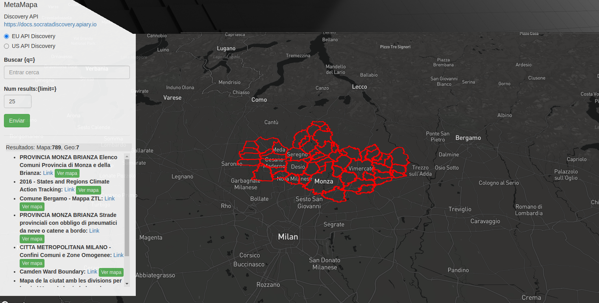

# Recursos open data

### [Ver presentación OpenData (pptx)](presentacion/opendata.pptx)
### [Ver presentación OpenData (pdf)](presentacion/opendata.pdf)


### El MetaMapa: Ejemplo de mapificació de resultados de Sócrata

>Buscaremos mapas en formato geojson con la api discovery de Sócrata
>[https://api.us.socrata.com/api/catalog/v1?q=chicago%20crime&only=maps](https://api.us.socrata.com/api/catalog/v1?q=chicago%20crime&only=maps){target=_blank}


* Para ir de la API Global hasta el recurso local debemos realizar 3 peticiones

* Peticio 1 API Global : ```https://api.us.socrata.com/api/catalog/v1?q=chicago%20crime&only=maps```

* Peticio dos obtener url recurso ```https://{dominio/api/views.json?method=getByResourceName&name={id recurso}```

* Petición 3  obterner el recurso ```https://{dminio}/api/geospatial/{recurso}?method=export&format=GeoJSON```


#### Paso 1 

* Creamos un archivo con el nombre de **metamapa.html** en  **/geoweb**.

* Creamos un archivo con el nombre de **socrata.js**. dentro de **/geoweb/js**

* Abrimos el archivo metamapa.html con VSCode y copiamos el siguiente código.

  
```html
<html>
<head>
    <meta charset='utf-8' />
    <title>MetaMapa</title>
    <meta name='viewport' content='initial-scale=1,maximum-scale=1,user-scalable=no' />
    <script src='https://api.mapbox.com/mapbox-gl-js/v2.0.1/mapbox-gl.js'></script>
    <link href='https://api.mapbox.com/mapbox-gl-js/v2.0.1/mapbox-gl.css' rel='stylesheet' />
    <link rel="stylesheet" href="https://stackpath.bootstrapcdn.com/bootstrap/3.3.7/css/bootstrap.min.css" />
    <link href='css/estilobase.css' rel='stylesheet' />
    <script src='js/utils.js'></script>
    <script src='js/socrata.js'></script>
    <style>
        #results {
            width: 100%;
            background-color: #f2f2f2;
            margin: 5px;
        }
        #mygrid{
            height: 340px;
            overflow:auto
        }

        #panelContainer {
            position: absolute;
            top: 0px;
            left: 0px;
            width: 350px;
            background-color: white;
            height: 95%;
            opacity: 0.9;
        }
        #num_results_socrata{
            width: 70px !important;
        }
        
    </style>
    <script>
        function init() {

            mapboxgl.accessToken = 'pk.eyJ1IjoiZ2lzbWFzdGVybTIiLCJhIjoiY2plZHhubTQxMTNoYzMza3Rqa3kxYTdrOCJ9.53B1E6mKD_EQOVb2Y0-SsA';
            var map = new mapboxgl.Map({
                container: 'map',
                style: 'mapbox://styles/mapbox/dark-v10',
                center: [9.746, 40.473],
                zoom: 5.5,
                hash: true,
                pitch: 45,
                attributionControl: false
            });
            map.addControl(new mapboxgl.AttributionControl({
                compact: true
            }));
            map.addControl(new mapboxgl.NavigationControl());


        }
    </script>
</head>

<body onload="init()">
    <div id='map'></div>
    <div id="panelContainer">             
            <div class="col-md-12">
                <h4>MetaMapa </h4>
                <p>Discovery API <br>
                    <a target="_blank"
                        href="https://docs.socratadiscovery.apiary.io">https://docs.socratadiscovery.apiary.io</a>
                </p>             
                    <div class="form-group">
                        <div class="radio">
                            <label>
                                <input type="radio" name="optionsRadios" id="optionsRadios1"
                                    value="https://api.eu.socrata.com/api/catalog/v1?" checked>
                                EU API Discovery
                            </label>
                        </div>
                        <div class="radio">
                            <label>
                                <input type="radio" name="optionsRadios" id="optionsRadios2"
                                    value="https://api.us.socrata.com/api/catalog/v1?">
                                US API Discovery
                            </label>
                        </div>
                    </div>
                    <div class="form-group">
                        <label for="text_filter_socrata"> Buscar {q=} <u></u></label>
                        <input type="text" class="form-control" id="text_filter_socrata" value=""
                            placeholder="Entrar cerca">

                    </div>             
                    <div class="form-group">
                        <label for="num_results_socrata">Num results:{limit=}</label>
                        <input type="number" class="form-control" id="num_results_socrata" value="100">
                    </div>               
                    <div class="form-group">
                        <button id="bt_send" type="button" class="btn btn-default btn-success">Enviar</button>
                    </div>
              
                <hr>
                <div id="results"></div>
                <div id="mygrid"></div>
            </div>
        </div>
</body>

</html>

```
  


* Añadimos dentro del tag  **socrata.js** la funcion **buscarMapas**

  
```js
function buscarMapas() {

    var options = document.getElementsByName("optionsRadios");
    var url_servidor;
    for (var i = 0; i < options.length; i++) {
        if (options[i].checked) {
            url_servidor = options[i].value;
        }
    }
    var textoBuscar = document.getElementById("text_filter_socrata").value; //encodeURI()
    var limiteResultados = document.getElementById("num_results_socrata").value;
    var peticion1 = url_servidor + "q=" + textoBuscar + "&limit=" + limiteResultados + "&only=map";
    // console.log(peticion1);

    enviarPeticion(peticion1).then(function (respuestaSocrata) {

        if (respuestaSocrata) {
           // console.info(respuestaSocrata);
            document.getElementById("results").innerHTML = "Resultados encontrados:<b>" + respuestaSocrata.resultSetSize + "</b>";
            //$('#mygrid').html('');

            var resultadosHTML;
            var contarGeojson = 0;
            if (respuestaSocrata.resultSetSize >= 1) {
                resultadosHTML = "<ul>";
                for (var i = 0; i < respuestaSocrata.results.length; i++) {

                    if (respuestaSocrata.results[i].resource["lens_view_type"] == "geo") {
                        contarGeojson = contarGeojson + 1;
                        resultadosHTML = resultadosHTML + '<li class="li"><b>' + respuestaSocrata.results[i].resource.name + ': </b>' +
                            '<a target="_blank" title="' + respuestaSocrata.results[i].resource.attribution + '" href="' + respuestaSocrata.results[i].link + '"> Link </a> ' +
                            '<a class="btn btn-success btn-xs" onClick="obtenerGeoJson(this.id)" title="' + respuestaSocrata.results[i].resource.attribution + '" href="#" id="' + respuestaSocrata.results[i].resource.id + '#' + respuestaSocrata.results[i].metadata.domain + '">Ver mapa</a>';
                    }
                }
                resultadosHTML = resultadosHTML + "</ul>";
                document.getElementById("mygrid").innerHTML = resultadosHTML;
                document.getElementById("results").innerHTML = "Resultados: Mapa:<b>" + respuestaSocrata.resultSetSize + "</b>, Geo:<b>" + contarGeojson + "</b>";

            } else {

                document.getElementById("results").innerHTML = "Error";
            }
        }
    });//fin peticion


} //finfuncion


```
  

* Llamamos a la funcion **buscaMapa()** desde  **metamapa.html** 

``` html hl_lines="96"
<html>
<head>
    <meta charset='utf-8' />
    <title>MetaMapa</title>
    <meta name='viewport' content='initial-scale=1,maximum-scale=1,user-scalable=no' />
    <script src='https://api.mapbox.com/mapbox-gl-js/v2.0.1/mapbox-gl.js'></script>
    <link href='https://api.mapbox.com/mapbox-gl-js/v2.0.1/mapbox-gl.css' rel='stylesheet' />
    <link rel="stylesheet" href="https://stackpath.bootstrapcdn.com/bootstrap/3.3.7/css/bootstrap.min.css" />
    <link href='css/estilobase.css' rel='stylesheet' />
    <script src='js/utils.js'></script>
    <script src='js/socrata.js'></script>
    <style>
        #results {
            width: 100%;
            background-color: #f2f2f2;
            margin: 5px;
        }
        #mygrid{
            height: 340px;
            overflow:auto
        }

        #panelContainer {
            position: absolute;
            top: 0px;
            left: 0px;
            width: 350px;
            background-color: white;
            height: 95%;
            opacity: 0.9;
        }
        #num_results_socrata{
            width: 70px !important;
        }
        
    </style>
    <script>
        function init() {

            mapboxgl.accessToken = 'pk.eyJ1IjoiZ2lzbWFzdGVybTIiLCJhIjoiY2plZHhubTQxMTNoYzMza3Rqa3kxYTdrOCJ9.53B1E6mKD_EQOVb2Y0-SsA';
            var map = new mapboxgl.Map({
                container: 'map',
                style: 'mapbox://styles/mapbox/dark-v10',
                center: [9.746, 40.473],
                zoom: 5.5,
                hash: true,
                pitch: 45,
                attributionControl: false
            });
            map.addControl(new mapboxgl.AttributionControl({
                compact: true
            }));
            map.addControl(new mapboxgl.NavigationControl());


        }
    </script>
</head>

<body onload="init()">
    <div id='map'></div>
    <div id="panelContainer">             
            <div class="col-md-12">
                <h4>MetaMapa </h4>
                <p>Discovery API <br>
                    <a target="_blank"
                        href="https://docs.socratadiscovery.apiary.io">https://docs.socratadiscovery.apiary.io</a>
                </p>             
                    <div class="form-group">
                        <div class="radio">
                            <label>
                                <input type="radio" name="optionsRadios" id="optionsRadios1"
                                    value="https://api.eu.socrata.com/api/catalog/v1?" checked>
                                EU API Discovery
                            </label>
                        </div>
                        <div class="radio">
                            <label>
                                <input type="radio" name="optionsRadios" id="optionsRadios2"
                                    value="https://api.us.socrata.com/api/catalog/v1?">
                                US API Discovery
                            </label>
                        </div>
                    </div>
                    <div class="form-group">
                        <label for="text_filter_socrata"> Buscar {q=} <u></u></label>
                        <input type="text" class="form-control" id="text_filter_socrata" value=""
                            placeholder="Entrar cerca">

                    </div>             
                    <div class="form-group">
                        <label for="num_results_socrata">Num results:{limit=}</label>
                        <input type="number" class="form-control" id="num_results_socrata" value="100">
                    </div>               
                    <div class="form-group">
                        <button id="bt_send" onClick="buscarMapas()" type="button" class="btn btn-default btn-success">Enviar</button>
                    </div>
              
                <hr>
                <div id="results"></div>
                <div id="mygrid"></div>
            </div>
        </div>
</body>

</html>

```

!!! Note "Realizamos algunas búsquedas"

#### Paso 2

* Añadimos a **socrata.js** la funcion **obtenerGeoJson()**

  
```javascript
function obtenerGeoJson(data) {

    var params = data.split("#");
    var peticion2 = 'https://' + params[1] + '/api/views.json?method=getByResourceName&name=' + params[0];

    enviarPeticion(peticion2).then(function (respuestaNodoSocrata) {

        //antes '/api/geospatial/' +respuestaNodoSocrata.childViews[0]

        var peticion3 = 'https://' + params[1] +  respuestaNodoSocrata.metadata.geo.owsUrl + '?method=export&format=GeoJSON';

           //console.info(respuestaNodoSocrata);


        enviarPeticion(peticion3).then(function (respuestaGeoJson) {

           // console.info(respuestaNodoSocrata.metadata.geo.bbox);
           /// console.info(respuestaGeoJson);

        });// fin peticion 2 

    });// fin peticion 2 

} //finfuncion


```  

!!! Note "Realizamos algunas búsquedas y descomentamos /comentamos consoles"


#### Paso 3

* Creamos funcion para ver los geojson ** verMapa** dentro de **socrata.js**

```js
function verMapa(geoJSON, bbox) {


    if (!map.getSource("datossocrata_source")) {

        map.addSource("datossocrata_source", {
            type: "geojson",
            data: geoJSON
        });

        map.addLayer({
            'id': 'socrata',
            'type': 'line',
            'source': 'datossocrata_source',
            'layout': {
                'line-join': 'round',
                'line-cap': 'round'
            },
            'paint': {
                'line-color': '#ff0000',
                'line-width': 3
            }
        });


    } else {

        map.getSource("datossocrata_source").setData(geoJSON);

    }

    var bounds = bbox.split(",")

    map.fitBounds([[bounds[0], bounds[1]], [bounds[2], bounds[3]]]);


}
```

* Llamamos a la funcion  ** verMapa** desde  **obtenerGeoJson**
```js hl_lines="19"

function obtenerGeoJson(data) {

    var params = data.split("#");
    var peticion2 = 'https://' + params[1] + '/api/views.json?method=getByResourceName&name=' + params[0];

    enviarPeticion(peticion2).then(function (respuestaNodoSocrata) {

        //antes '/api/geospatial/' +respuestaNodoSocrata.childViews[0]

        var peticion3 = 'https://' + params[1] + '/api/geospatial/' +respuestaNodoSocrata.childViews[0] + '?method=export&format=GeoJSON';

        //console.info(respuestaNodoSocrata);


        enviarPeticion(peticion3).then(function (respuestaGeoJson) {

            // console.info(respuestaNodoSocrata.metadata.geo.bbox);
            // console.info(respuestaGeoJson);
            verMapa(respuestaGeoJson, respuestaNodoSocrata.metadata.geo.bbox)

        });// fin peticion 2 

    });// fin peticion 2 

} //finfuncion

```




!!! success "¿Subimos el ejemplo al GitHub?"
	
```bash

		git pull
        git add .
        git commit -m "socrata"
        git push

```   