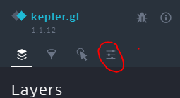
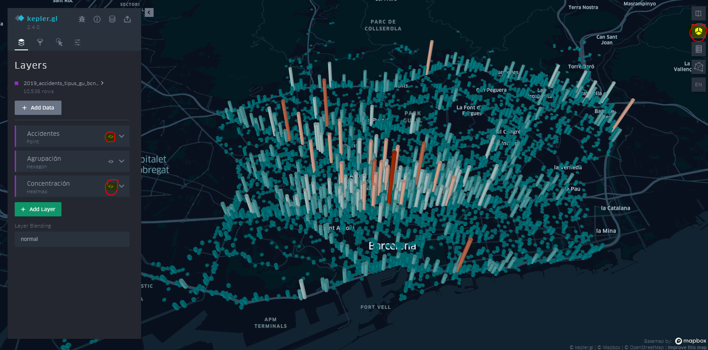
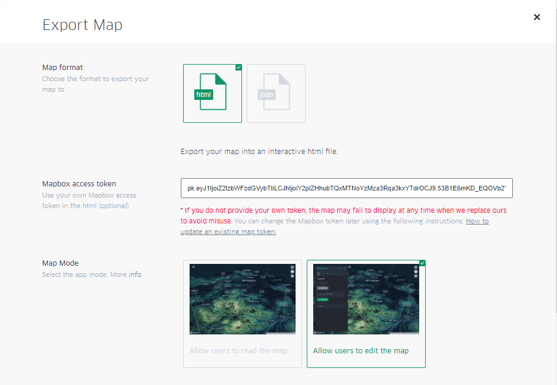

       
#### Web
* [https://kepler.gl/](https://kepler.gl/)

#### Aplicación
* [https://kepler.gl/demo](https://kepler.gl/demo)


#### **Página referéncia Kepler GL**
* [https://github.com/keplergl/kepler.gl/blob/master/docs/user-guides/a-introduction.md](https://github.com/keplergl/kepler.gl/blob/master/docs/user-guides/a-introduction.md)

#### GitHUB
* [https://github.com/keplergl](https://github.com/keplergl)

#### Tutoriales
* [https://github.com/keplergl/kepler.gl/blob/master/docs/user-guides/a-introduction.md](https://github.com/keplergl/kepler.gl/blob/master/docs/user-guides/a-introduction.md)
* [https://github.com/keplergl/kepler.gl/blob/master/docs/user-guides/j-get-started.md](https://github.com/keplergl/kepler.gl/blob/master/docs/user-guides/j-get-started.md)


#### Videos
* [https://www.youtube.com/watch?v=b8wKEY4dlvg](https://www.youtube.com/watch?v=b8wKEY4dlvg)
* [https://www.youtube.com/watch?v=y-SA6bOv4Eo](https://www.youtube.com/watch?v=y-SA6bOv4Eo)
* [https://www.youtube.com/watch?v=i2fRN4e2s0A](https://www.youtube.com/watch?v=i2fRN4e2s0A)


### Descripción 

Kepler.gl es una aplicación desrrollada por Uber, en un principio para uso interno, para analizar y visualizar sus propios datos.

Esta basada en WebGL pensada para  la exploración visual de conjuntos de datos de geolocalización a gran escala. Construido en la parte superior de deck.gl, kepler.gl puede representar millones de puntos que representan miles de viajes y realizar agregaciones espaciales sobre la marcha.


### Ejercicio de visualización con Kepler.gl

!!! tip "Queremos analizar los accidentes de coche en la ciudad de Barcelona"

    Hemos visto este post en Medium, sobre accidentes de Barcelona [https://towardsdatascience.com/analysis-of-car-accidents-in-barcelona-using-pandas-matplotlib-and-folium-73384240106b](https://towardsdatascience.com/analysis-of-car-accidents-in-barcelona-using-pandas-matplotlib-and-folium-73384240106b)
    
### Preparación datos

* Origen dataset CSV de [Personas involucradas en accidentes gestionados por la Guardia Urbana en la ciudad de Barcelona](https://opendata-ajuntament.barcelona.cat/data/es/dataset/accidents-persones-gu-bcn)

* Descargamos [2018_accidents_tipus_gu_bcn_.csv](datos/2018_accidents_tipus_gu_bcn_TIME.csv)

* En este archivo se han concatenado las fechas para añadir un nuevo campo tipo timestamp

!!! Truco "Con LibreOffice seria"
    ```
    =CONCATENATE(L2;"-";M2;"-";O2;"T";Q2;":00")
    ```


#### Paso1 : Añadir datos el mapa

* Vamos a http://kepler.gl/#/demo 

* Cargamos **2018_accidents_tipus_gu_bcn_TIME.csv**

>  `Añadimos csv`


#### Paso2 : Añadimos estilo própio




`Base map` -->`add Map Style` --> `Paste style url` 


#### Paso2 : Añadir capas

* Añadimos tres capas de tipo **Punto**,**Hexbin**, **HeatMap**

* Ejemplo para HexBin

    > `Add Layer: Type Hexbin`

    > `Columns: Latitud Longuitud`

    > `Color: Scale Quantize`

    > `Hexagon radius 0.1`

    > `Coverage 0.75`




* Visualizamos su capacidades y realizamos temàticos

#### Paso1 : Añadir filtros

* Permite filtrar los datos de todas las capa asociadas a un dataset


* Por dia de la semana
* Por el campo **Time**


#### Paso1 : Definir "tooltips"


#### Paso1 : Guardar y exporta a HTML



* Exportamos nuestro mapa a formato HTML **accidentes.html** dentro de nuestro proyecto /geoweb
#### Paso1 : Subir al GIT

!!! success "¿Subimos el ejemplo al GitHub?"
	
	```bash

		git pull
        git add .
        git commit -m "Mapa Kepler"
        git push

	```    

!!! success "Mirámos Medium"
	
    https://medium.com/
